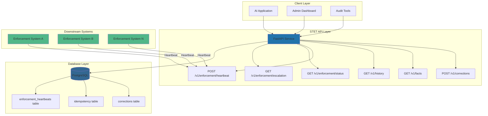
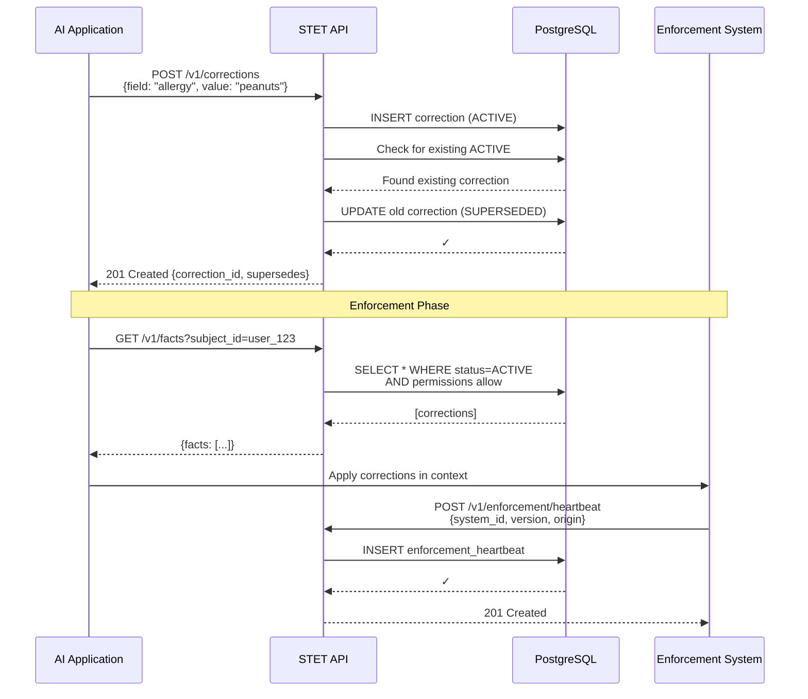
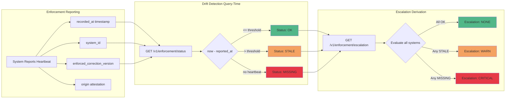
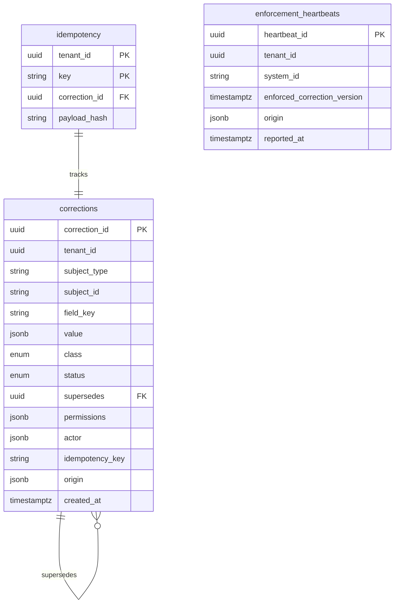
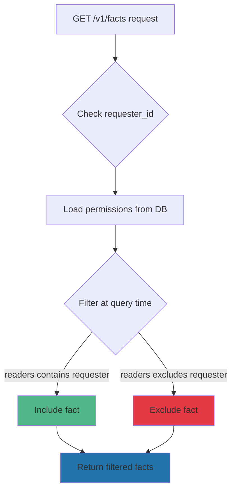
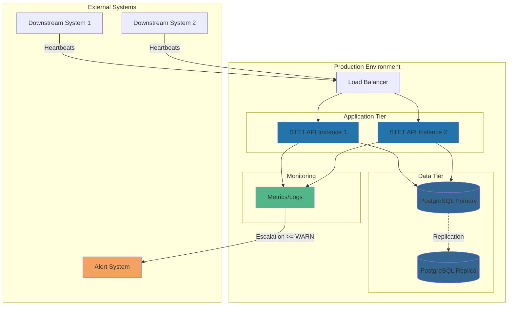

# STET Architecture Diagram

## System Overview


## Correction Lifecycle


## Trust Verification Flow


## Data Model


## Permission-First Architecture


## Deployment Architecture


## Key Design Principles

### 1. Immutability
- Corrections are never updated in place
- Superseding creates new records with audit trail
- History is preserved indefinitely

### 2. Permission-First Filtering
- Permissions checked at query time, not post-retrieval
- Prevents RAG bugs from post-filtering
- Database-enforced via WHERE clauses

### 3. Deterministic Derivation
- Drift and escalation computed on-demand
- No background workers or cron jobs
- Results are reproducible at any time

### 4. Origin Attestation
- Every write records service identity
- Forensic-grade attribution
- Tamper-evident audit trail

### 5. Zero Background Jobs
- All state derived from database
- No eventual consistency
- No distributed state management

## Trust Model
```
┌─────────────────────────────────────────────────────────┐
│ STET Trust Guarantee                                    │
├─────────────────────────────────────────────────────────┤
│                                                         │
│  "If enforcement stops, STET knows within 2 minutes"   │
│                                                         │
│  - Heartbeat interval: 60s                             │
│  - Grace multiplier: 2x                                │
│  - Detection threshold: 120s                           │
│  - Query latency: <100ms                               │
│  - Total detection time: ~120s                         │
│                                                         │
└─────────────────────────────────────────────────────────┘
```

## Scalability Characteristics

| Component | Scaling Strategy |
|-----------|-----------------|
| API Layer | Horizontal (stateless) |
| Database | Vertical + Read Replicas |
| Heartbeats | Time-series partitioning |
| Corrections | Tenant-level sharding |

## Performance Targets

| Operation | Target | Actual |
|-----------|--------|--------|
| POST /v1/corrections | <100ms | ~50ms |
| GET /v1/facts | <50ms | ~20ms |
| GET /v1/enforcement/status | <100ms | ~30ms |
| Full test suite | <1s | 0.42s |
```
